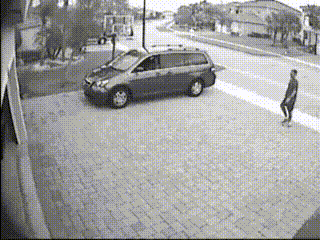
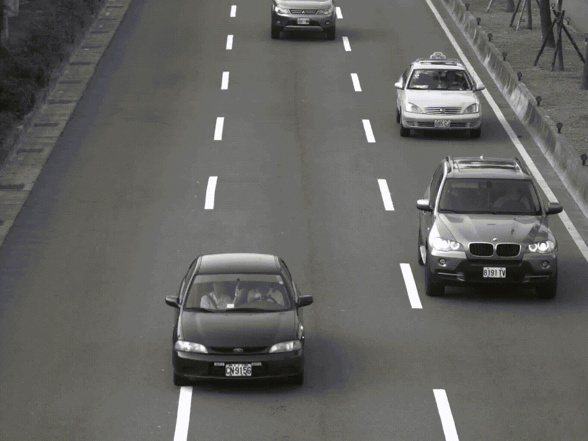

# INTRODUCTION

**Foreground Detection is the process of detecting changes in image sequences(Or Video). Background Separation is any technique which allows an image's foreground(or moving object or object to be focused) to be extracted for further processing(eg. object recognition, etc.)**. With the ever increasing demand for better security features and rising computing power, better object tracking, background separation for security or surveillance or still video cameras has become almost an integral part for automated motion or subject detection or video processing.

**A Grayscale(Color) Video, after all, is nothing but a set of 2D matrices(three sets of 2D matrices) stitched together into 3D matrix, where 3rd dimension is time or frame i.e. single channel(3 channels -RGB) of intensity values(0 to 1, both inclusive)**. So, there are parts of videos where the pixel intensity doesn't change at all or changes but very little, whereas the parts where the moving object passes there are high and steep change in the pixel intensities. We can thus model each pixel intensity wrt time and take advantage of the change of the pdf we fit to each pixel of the video over time.

# IDEA & METHOD

Video is a set of 2D Images. Think of each pixel of the image and observe it over time, we now have a sample of intensity values of that pixel over time. Let this sample be $x_1, x_2,\dots, x_N$. We can obtain **the estimate of pixel intensity values by using kernel density estimation**. Given the observed $x_t$ at time $t$, we can estimate probability density function of the observation as,
$$\hat{f}(x_t) = \frac{1}{N}\sum_{i=1}^N K_\sigma(x_t-x_i)$$
where $K_\sigma$ is a kernel function with bandwidth $\sigma$. In our case we will using Normal Kernel with $\sigma = (\frac{4}{5})^{\frac{1}{7}}N^{-\frac{1}{7}}$. Here $N$ is the sample size.

Now, the pixels which have the moving object will have higher pdf value evaluated in that frame compared to the parts which are still and hence assuming to form the background. We **choose the pixel values for a frame whose pdf exceeds some preset threshold as the background**.

# APPLICATION

Here we apply the above described method on some surveillance and traffic videos.
- We have the following surveillance footage. We consider the 100th frame for our application here.

<!-- -->

- We will apply the above method discussed on this footage. We first take a look at the density values obtained from KDE of the pixel at row = 228, col = 63 over time frame from 90 to 110. It is clearly visible how the **background pixel at (3,3)'s KDE density estimates over time remain almost same and high, during motion the KDE density estimates drops to a low value. We used threshold value of 0.123** 

<!-- -->

- Now, we take a look at the background separated 100th frame. It performs really good as can be seen below.

<!-- -->

- We consider another video footage of traffic on a road at the 20th Frame. The main 3 cars and the density plot without threshold is almost perfect in separating background. The jagged threshold plot is dependent on the threshold and varies with sitation. We can use an adaptive method to set the threshold for better performance.
<!-- -->

<!-- -->

This wraps up the application of our KDE Method for moving object detection.

# CONCLUSION

We can use this method in:

- Security and Surveillance cameras to detect motion.
- Motion and Object detection.
- Enhancing and Focusing on region of action.
- It is comparatively computationally fast.
- It is immune to slight changes in background

Drawbacks:

- It fails to use the spatial correlation.
- It fails to detect entire object clearly at difficult situations.
